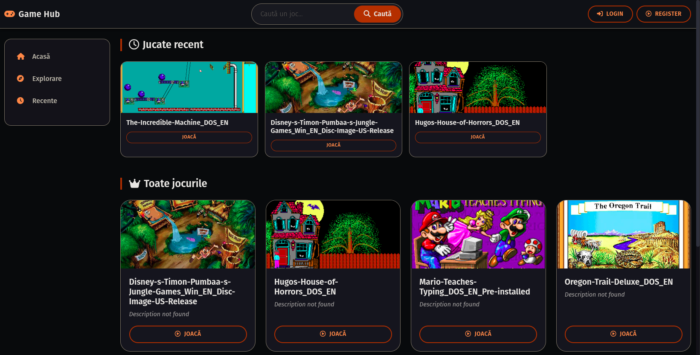
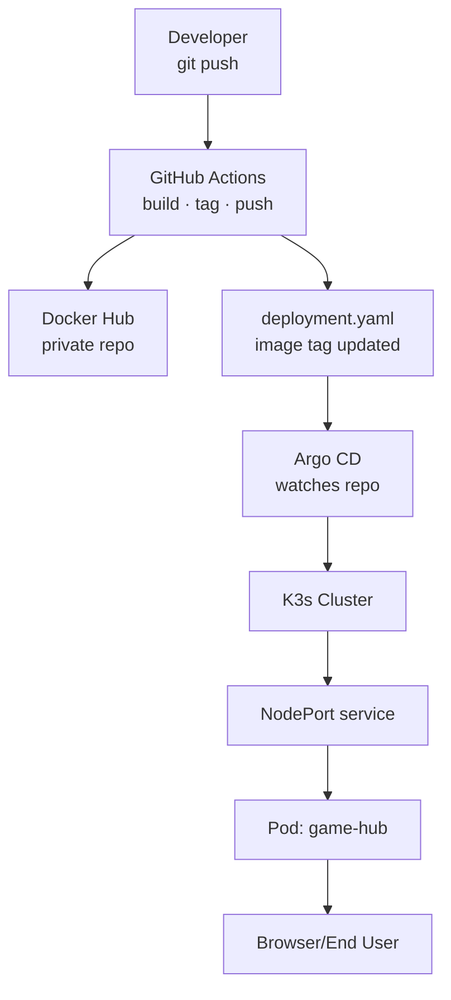

# Overview

This is a website that allows me and my collaborator to play our old DOS games library through DOSBox.
The entirety of the website HTML and Javascript code was written by Theodor20, while the hosting infrastructure and CI/CD pipeline was implemented by ipatedavid.

---

## CI/CD Pipeline & Infrastructure

The web app is served from a self-managed, bare-metal Kubernetes cluster running on an Orange Pi Zero 3. The full deployment lifecycle is automated via a GitOps workflow:

- **CI:** GitHub Actions builds and versions a Docker image on every push to `main`, pushing the resulting artifact to a private Docker Hub repository and updating `deployment.yaml` with the new image tag.
- **CD:** Argo CD continuously monitors the repository for manifest changes and automatically synchronises the cluster to the desired state.

---


## Setup Notes

### Image Pull Secret

Create a Docker Hub credentials secret in your cluster to allow the deployment to pull from the private registry:

```bash
kubectl create secret docker-registry dockerhub-creds \
  --docker-username=YOUR_USERNAME \
  --docker-password=YOUR_TOKEN \
  --docker-email=YOUR_EMAIL
```

### Argo CD — Cluster-Scoped Resources

If your Argo CD project is namespace-scoped, cluster-wide resources such as `PersistentVolume` objects will fail to deploy. To resolve this, add the relevant resource types to the project's **Cluster Resource Allow List** via the Argo CD UI or project manifest.
