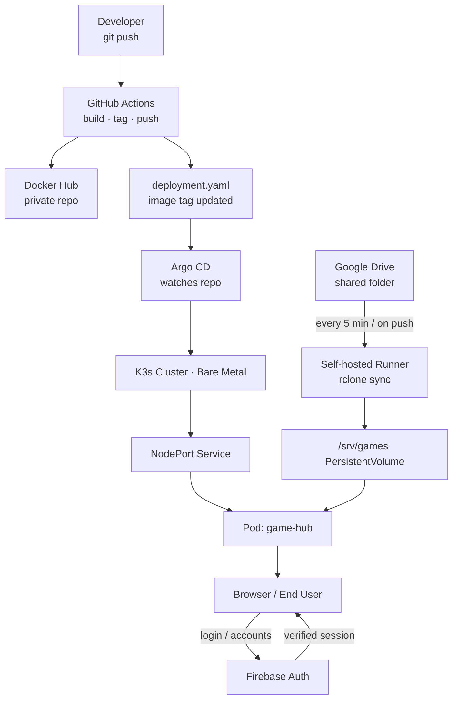

# Overview

This is a website that allows me and my collaborator to play our old DOS games library through DOSBox.
The entirety of the website HTML and Javascript code was written by Theodor20, while the hosting infrastructure and CI/CD pipeline was implemented by ipatedavid.

---

## CI/CD Pipeline & Infrastructure

The web app is served from a self-managed, bare-metal Kubernetes cluster running on an Orange Pi Zero 3. The full deployment lifecycle is automated via a GitOps workflow:

- **CI:** GitHub Actions builds and versions a Docker image on every push to `main`, pushing the resulting artifact to a private Docker Hub repository and updating `deployment.yaml` with the new image tag.
- **CD:** Argo CD continuously monitors the repository for manifest changes and automatically synchronises the cluster to the desired state.

### Database

The website features integration with Firebase for accounts. 

###  Storage

The games library is stored in a single shared Google Drive folder, synchronized to the cluster using a self-hosted Actions runner that triggers `rclone` every 5 minutes and on every commit to `main`.

#### Setting up rclone

After configuring rclone for Google Drive, you may need to manually restrict its root folder. Add the following line to your `rclone.conf` under the remote you created:
```ini
root_folder_id = YOUR_FOLDER_ID
```

> The folder ID is the last segment of your Google Drive folder URL:
> `https://drive.google.com/drive/folders/`**`YOUR_FOLDER_ID`**

#### Runner permissions

The self-hosted runner requires write access to the cluster's local storage folder used for the game library. When installing the runner, ensure it runs under a user with appropriate permissions to that directory.

See [GitHub's self-hosted runner docs](https://docs.github.com/en/actions/hosting-your-own-runners/about-self-hosted-runners) for installation instructions.


### Argo CD — Cluster-Scoped Resources

If your Argo CD project is namespace-scoped, cluster-wide resources such as `PersistentVolume` objects will fail to deploy. To resolve this, add the relevant resource types to the project's **Cluster Resource Allow List** via the Argo CD UI or project manifest.



## Setup Notes

### Image Pull Secret

Create a Docker Hub credentials secret in your cluster to allow the deployment to pull from the private registry:

```bash
kubectl create secret docker-registry dockerhub-creds \
  --docker-username=YOUR_USERNAME \
  --docker-password=YOUR_TOKEN \
  --docker-email=YOUR_EMAIL
```
---

# Theodor20`s Notes

## Frontend Architecture 

### Overview

The frontend of the application is built using **HTML**, **CSS**, and **vanilla JavaScript**.
For layout and responsiveness the project uses **Bootstrap 5**, while **Font Awesome** provides UI icons.

The interface follows a **dark theme** with an orange accent color (`#ff8c42`) applied to interactive elements.

---

### Application Pages

The application consists of several core pages:

| Page                           | Purpose                                                                     |
| ------------------------------ | --------------------------------------------------------------------------- |
| `index.html`                   | Main page displaying all available games with search and sidebar navigation |
| `game.html`                    | DOS game player using the **js-dos** emulator                               |
| `emulator.html`                | Emulator page for **SNES, GBA and NES** games using **EmulatorJS**          |
| `login.html` / `register.html` | User authentication pages                                                   |

---

### JavaScript Modules

Client-side logic is organized inside the `/js` directory:

* **auth.js** – Firebase authentication logic (register, login, logout, auth observer)
* **firebase-config.js** – Firebase initialization and configuration
* **game.js** – legacy DOS game logic (later integrated into page-specific scripts)

---

### Firebase Integration

The project uses **Firebase** for authentication and user data.

**Authentication**

User accounts are handled using **Firebase Authentication (email/password)**.
The authentication state is monitored globally via `onAuthStateChanged`.

Depending on the state:

* Logged out → **Login / Register buttons**
* Logged in → **User email + Logout button**

**Favorites System**

Favorite games are stored in **Firestore**.

Structure:

```
favorites (collection)
   └── userUID (document)
        └── gameIds: []
```

Game IDs are updated using:

* `arrayUnion()` – add favorite
* `arrayRemove()` – remove favorite

The UI heart icon updates dynamically based on this list.

---

### Emulator Implementation

#### DOS Games

DOS games are executed using **js-dos (v6.22)**.

Execution flow:

1. A `canvas` element is created in the DOS container
2. `wdosbox.js` is loaded dynamically
3. The game ZIP archive is mounted into the DOSBox filesystem
4. Execution starts via `START.BAT`

---

#### Console Games

Console games (GBA, SNES, NES) run through **EmulatorJS**.

The emulator is configured through global variables:

```
EJS_core
EJS_gameUrl
EJS_startOnLoaded
EJS_color
```

The correct platform core is selected based on the `platform` field returned by the API.

---

### Backend API

The frontend communicates with a **Node.js + Express** backend.

Endpoint:

```
GET /api/games
```

The server scans the `/games` directory and returns a JSON array describing all available games.

Example game object:

```
{
  id,
  title,
  file,
  zip,
  description,
  imageUrl,
  platform
}
```

ROM files and images are served directly from the `/games` directory.

---

### Client Features

**Game Listing**

* Fetches `/api/games`
* Dynamically renders game cards
* Displays cover image, title, description, favorite button and play button

**Search**

Games can be filtered in real time by title using client-side JavaScript.

**Sidebar Navigation**

* **Home** – show all games
* **Explore** – open a random game
* **Recent** – last 5 played games
* **Favorites** – user favorites (requires login)

---

### Recent Games (Local Storage)

Recently played games are stored in:

```
localStorage["recentGames"]
```

The list stores up to **5 games**, each containing:

* id
* title
* file
* description
* imageUrl
* platform

This list is updated whenever a game is launched.

---

### Security & Technical Considerations

**XSS Prevention**

Game titles and descriptions are sanitized using a custom `escapeHtml()` function before DOM insertion.

**CORS**

The API and static content are served from the same origin, eliminating cross-origin issues.

**Responsive Design**

Bootstrap's grid system ensures compatibility across desktop and mobile devices.

---

### Local Development

1. Install **Node.js**
2. Install dependencies

```
npm install express
```

3. Create the `/games` directory and platform subfolders
4. Add games with ROM files and optional metadata
5. Start the server

```
node server.js
```

6. Open

```
http://localhost:3000
```

---

### Firebase Setup

Update the configuration inside:

```
/js/firebase-config.js
```

with valid Firebase project credentials.

Enable the following services in the Firebase Console:

* **Authentication**
* **Firestore Database**
